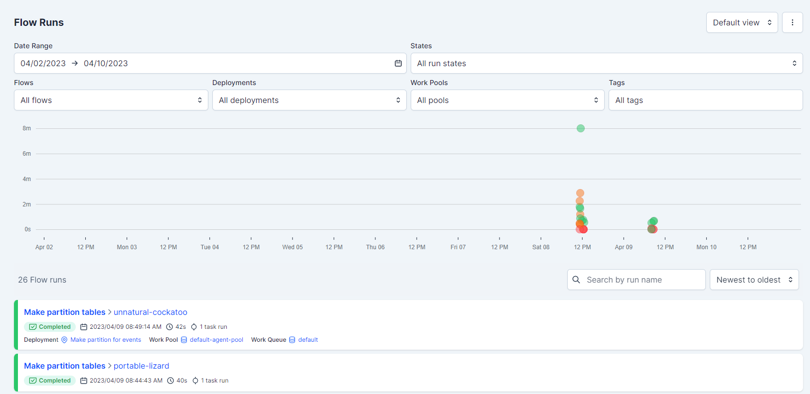
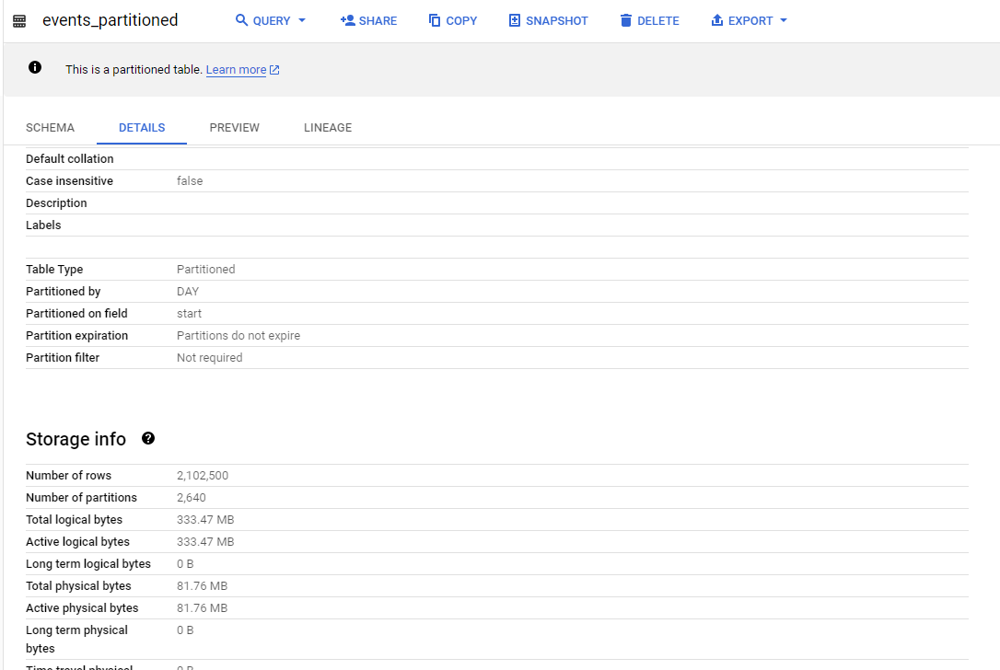

# de_zoomcamp_2023_project

My project at [DataTalks Data Engineering zoomcamp course](https://github.com/DataTalksClub/data-engineering-zoomcamp)   
Cohort: **January 2023 - March 2023**  
Student: **Roman Zabolotin**

## Project description and dataset


I found data for project at platform **[culture.ru](https://pro.culture.ru)** with an API access.  
It contains information about events in the field of culture for the period from *Jan 2021* to *March 2023*.
In this project I use this data for making ETL pipelines, moving data to data warehouse and visualization.

The main goal of this project is to get hands-on experience in data engineering.   
The secondary goal is to find main trends in the field of culture in Russia.

## Cloud platform


In this project I use [Google Cloud Platform](https://cloud.google.com/)  

Services:
  - [Google Cloud Storage](https://cloud.google.com/storage)
  - [BigQuery](https://cloud.google.com/bigquery)
  - [Looker](https://looker.com/)

### Terraform
I used terraform to create infrastructure in GCP.  
My terraform code is presented [here](terraform/main.tf)

To deploy terraform project you need to run following steps:
1. Authenticate to GCP
```bash
gcloud auth application-default login
```
2. Fill `terraform.tfvars` file (you can use terraform.tfvars.example as example)
3. Run terraform
```bash
terraform init
terraform apply
```

It will create:
- GCS bucket
- BigQuery dataset


## Data ingestion and loading to DWH
To collect data I use [API](https://pro.culture.ru/api/v1/docs/) of platform **[culture.ru](https://pro.culture.ru)**  
I've written a special script to collect data from that API.  
Then I've used [Prefect](https://www.prefect.io/) to orchestrate the process of data ingestion.

It gathers data from 3 API methods:
- events
- locations
- organizations

For each method I've created a separate flow in Prefect.

Example of flow diagram for events endpoint:


Each flow has 4 main tasks:
- **load_data** - get data from API
- **save_to_parquet** - save data in parquet format
- **upload_to_gcs** - upload data to GCS
- **load_to_bq** - load data to BigQuery

Some flows make more than one table in BigQuery.  
The resulted list of tables in BigQuery is:
- events
- event_tags
- event_places
- event_locales
- event_seances
- locales
- organizations
- organization_locales

**More information about data ingestion you can find [here](data_ingestion/README.MD)**

Dashboard of Prefect server:


## Optimizing data warehouse
The biggest table in the project is **events** table.  So let's make partitioning for it.  
After all data was loaded to BigQuery I've made one more flow in Prefect to optimize data warehouse.

In [this flow](data_ingestion/flow_optimization.py) I run bigquery queries to make partitioning for **events** table.




## Transformation, making data marts
After the data is loaded to BigQuery I've made some transformations and created data marts using dbt.

I've created 4 dbt models:
- **fct_events** - main fact table
- **dim_organizations** - dimension table
- **dim_locations** - dimension table
- **lnk_event_localations** - link table between events and locations

After running dbt I've got following result (4 tables in prod dataset):


Dbt generates documentation for each model. Here are some examples of it:


The dbt project is presented [here](dbt_project/README.md)


## Data visualization
I've created a dashboard in [Google Looker](https://lookerstudio.google.com/) to visualize data.

The report had 3 pages:


Dashboard is shared and it is available by [this link](https://lookerstudio.google.com/reporting/c4ff81c9-0cd5-4aea-a392-03033006cded)


## Poetry
I use [Poetry](https://python-poetry.org/) to manage dependencies in my project.  
To install poetry you need to run following command:
```bash
pip install poetry
```

To install dependencies you need to run following command:
```bash
poetry install
```


Beforehand you need to set environment variables, you can use .env.example as example
```bash
export $(cat .env.example | xargs) #set environment variables from file .env.example
```

After that you can run commands in poetry environment (some examples):
```bash
poetry run python data_ingestion/flow_events.py # run events flow
poetry run prefect orion start # start orion server
poetry run prefect agent start -q default # start prefect agent
poetry run prefect data_ingestion/make_deployments.py # make prefect deployments
cd dbt_project && poetry run dbt run # run dbt project
poetry 
```
