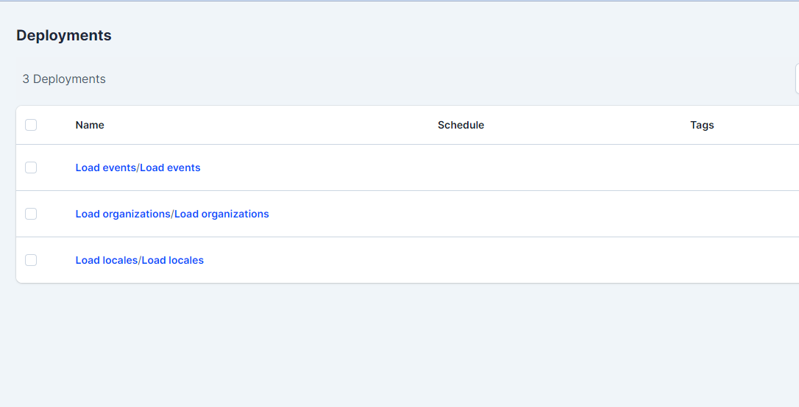
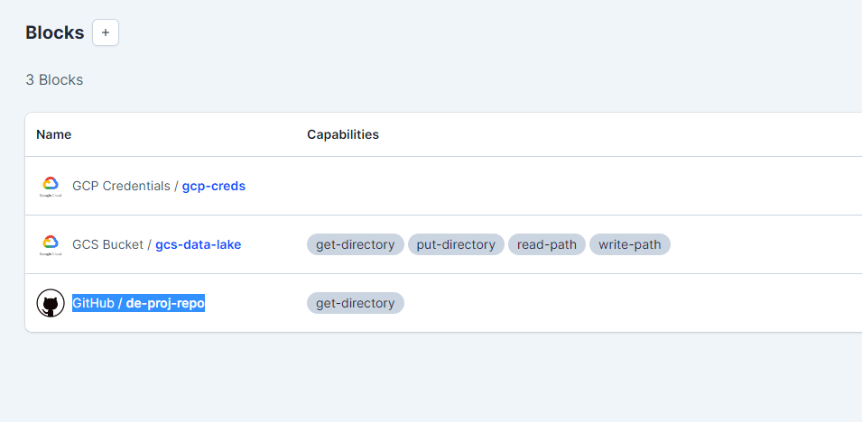
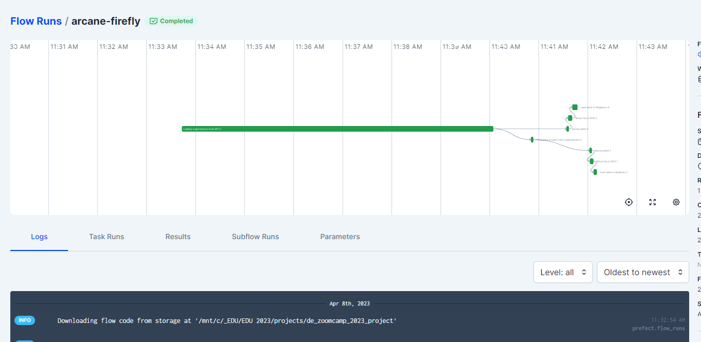
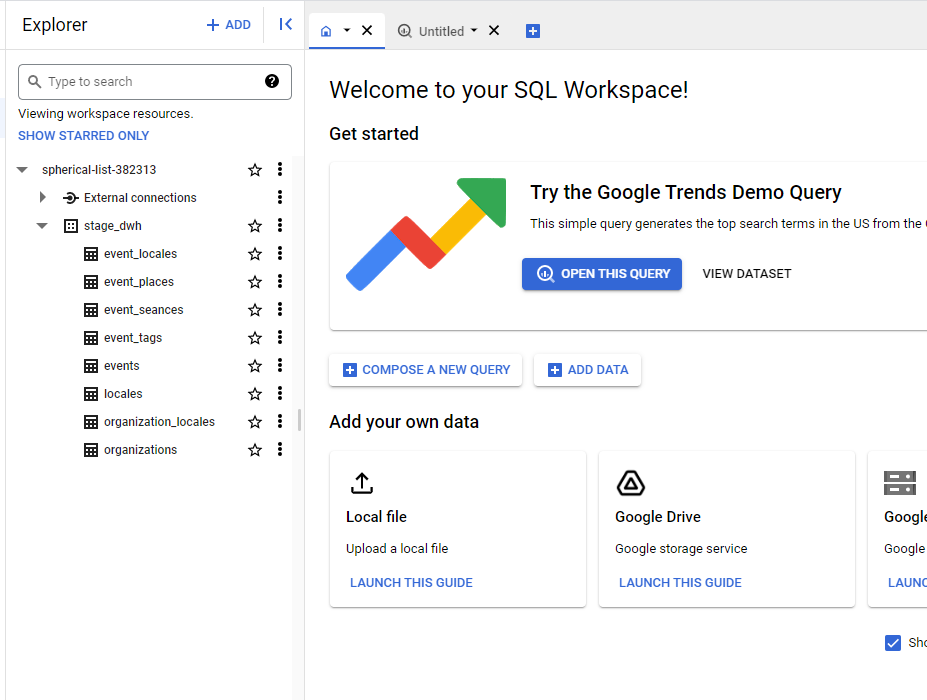

# Data loader
This project is about to collect data from [culture.ru](https://pro.culture.ru) API and load it to GCS bucket.

## Data ingestion
To collect data I use request library and save json data from API and save it as parquet files locally.  

Main script for manual data loadiog is [data_loader.py](data_ingestion/data_loader.py). It can be run manually.

Example of usage:
```bash
poetry run python data_ingestion/data_loader.py orgs
```

I used following methods from API:
- Events (`events`)
- Organizations (`orgs`)
- Locations (`locales`)

## Orchestration
I used [Prefect](https://www.prefect.io/) to orchestrate data ingestion.  
I've created deployment script that encapsulates all the logic of data ingestion, and sends files it to GCS Bucket.


## Flows

For each method I've created a separate flow in Prefect.
- [events](flow_events.py)
- [locations](flow_locales.py)
- [organizations](flow_orgs.py)

## Deployments

To make deployment for flow I've written the following script [make_deployments.py](make_deployments.py).



## Blocks

To run flow in your prefect server you need to create blocks.
- GCS Bucket\gcs-data-lake - the place were data will be stored
- GitHub\de-proj-repo - link to the current project, to load fresh code for flows



## Flow runs

Example of flow run




## Agents

The flow code is required for some Enviroment Variables to be set.  
You can find them in the [env.sample](../.env.sample) file.
They need to be set berfore running the flow.  

## In the result data from API is loaded to GCS bucket and then to BigQuery




